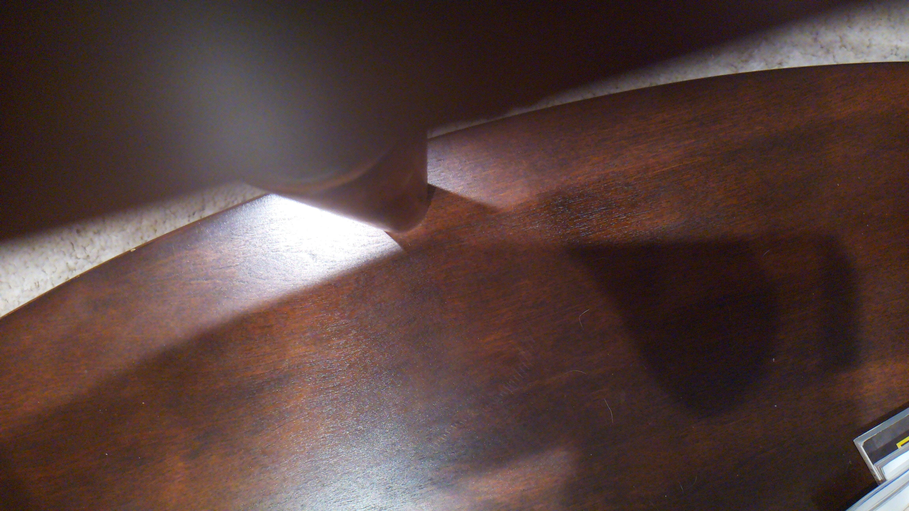
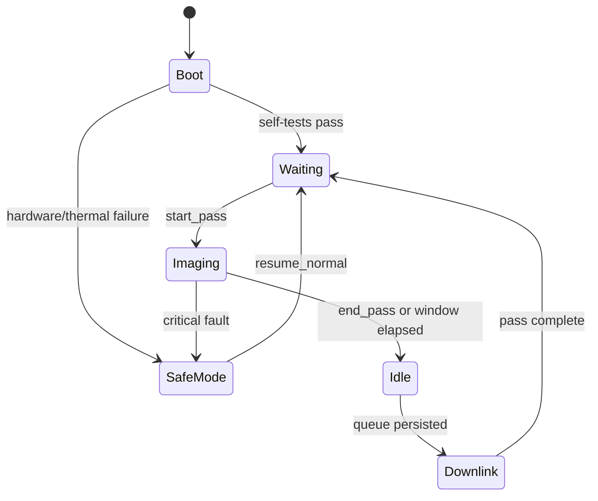
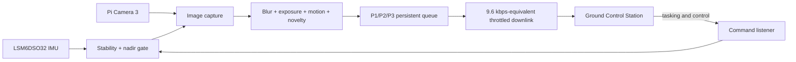
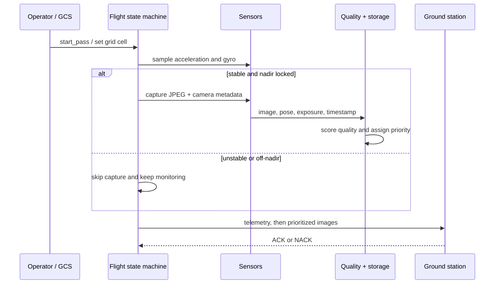

# MuraltZ CubeSat Flight Software

Raspberry Pi flight software developed for an MIT Beaver Works Summer Institute
CubeSat prototype. MuraltZ gates image capture using live IMU data, scores and
prioritizes observations onboard, and downlinks the highest-value science within
a deliberately constrained communications window.

> Companion repository: [MuraltZ Ground Control Station](https://github.com/Ayush1298567/MIT-Cubesat-Ground-Control-Station)

<p align="center">
  
  
  
</p>

## Mission architecture





### Engineering highlights

- Explicit mission state machine with boot self-tests and recoverable safe mode.
- IMU-gated capture with nadir hysteresis to prevent unstable threshold chatter.
- Onboard image-quality scoring and novelty-aware downlink prioritization.
- Persistent queue, image index, coverage map, and watchdog recovery state.
- ACK/NACK transfers with retries, MD5 integrity metadata, and link throttling.
- Pixel-level terrain segmentation and A* route planning components.
- Configurable runtime paths/network settings and hardware-independent tests.

## Hardware

| Component | Device | Interface |
|---|---|---|
| Flight computer | Raspberry Pi 4 (2 GB) | Raspberry Pi OS |
| Camera | Pi Camera Module 3 / IMX708 | CSI, `picamera2` |
| IMU | LSM6DSO32 | I²C at `0x6A` |
| Ground link | Pi Wi-Fi | TCP data and command channels |
| Thermal input | Pi CPU sensor | Linux sysfs |

## Flight data path



## Raspberry Pi setup

The flight entry point expects Raspberry Pi OS with camera support enabled.
`picamera2` is normally installed from the OS package repository:

```bash
sudo apt update
sudo apt install -y python3-picamera2 python3-opencv
git clone https://github.com/Ayush1298567/MIT-BWSI-Cubesat.git
cd MIT-BWSI-Cubesat
python3 -m venv --system-site-packages .venv
source .venv/bin/activate
pip install -r requirements-hardware.txt
```

Configure the ground-station address and data location:

```bash
export GROUND_STATION_IP=192.168.1.225
export CUBESAT_DATA_ROOT=/home/cubesat/cubesat_flight/data
```

Verify hardware before flight:

```bash
cd cubesat_flight
python test_hardware.py
python test_quality.py 10
python main.py
```

The quality calibration step matters: the correct blur threshold depends on the
texture and lighting of the physical terrain testbed.

## Operator commands

| Command | Effect |
|---|---|
| `start_pass` / `end_pass` | Begin or stop an imaging window |
| `cell R C` | Tag subsequent captures with the current survey cell |
| `status` | Print storage, temperature, and link state |
| `eclipse_on` / `eclipse_off` | Switch manual low-light mode on/off |
| `kill_link` / `resume_link` | Exercise link-loss recovery |
| `resume` | Recover from safe mode |
| `shutdown` | Persist state and stop cleanly |

Equivalent JSON commands can be sent from the companion GCS over port `5001`.

## Hardware-independent verification

On a laptop:

```bash
python3 -m venv .venv
source .venv/bin/activate
pip install -r requirements.txt
cd cubesat_flight
export CUBESAT_DATA_ROOT="$(mktemp -d)"
python -m compileall -q .
python -m unittest -v test_processing.py
```

These checks exercise segmentation-to-grid projection and A* behavior without
requiring a Pi camera or IMU.

## Repository map

```text
cubesat_flight/
├── states/       # boot, imaging, idle, downlink, safe mode
├── sensors/      # camera and LSM6DSO32 adapters
├── processing/   # quality, coverage, segmentation, route planning
├── comms/        # packet framing, command listener, transfer client
├── storage/      # persistent queue, image index, recovery state
├── utils/        # telemetry, watchdog, thermal monitor, logging
└── dashboard/    # lightweight segmentation/route inspection UI
```

See [`docs/ARCHITECTURE.md`](docs/ARCHITECTURE.md) for the detailed protocol,
state behavior, metadata schema, data budget, and calibration procedure.

## Design constraints

The prototype intentionally simulates a `9,600 bps` UHF-class link by limiting
payload throughput to `1,200 bytes/s`. At the default 60-second downlink window,
only about 72 KB is available, so onboard selection is part of the mission
architecture rather than a dashboard-only feature.

This is educational prototype software, not flight-certified avionics. Hardware
thresholds require calibration, yaw is unavailable because the IMU has no
magnetometer, Wi-Fi stands in for a radio, and route-planning outputs depend on
the accuracy of the generated terrain map.
