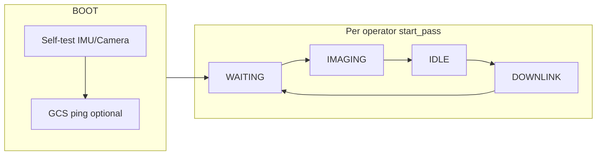

# MuraltZ Flight Software — Deep Technical Reference

**Repository:** `MIT-BWSI-Cubesat-Flight-Software`  
**Runtime:** Python 3 on Raspberry Pi 4 (2 GB)  
**Mission:** Artemis Lunar Navigator demo (MIT BWSI) — handheld “satellite” over a sandbox with Wi‑Fi standing in for a UHF downlink.

This document is a **module-by-module walkthrough** of what actually runs on the vehicle. For a shorter overview, see [`ARCHITECTURE.md`](./ARCHITECTURE.md). For the wire protocol shared with the ground station, see `cubesat_flight/protocol.py` (kept in sync with the GCS copy).

---

## 1. Big picture: process architecture

The flight computer runs **one Python process** (`main.py`) built around a **finite-state machine**. Concurrency is limited to **daemon threads** that do not own hardware exclusively except where noted:

| Thread / component | Role |
|--------------------|------|
| **Main thread** | State machine, imaging loop, IDLE, DOWNLINK, stdin command handling |
| **CommandListener** | TCP server on `COMMAND_PORT` — GCS sends JSON commands |
| **StdinReader** | Non-blocking queue of operator lines (`start_pass`, `cell R C`, etc.) |
| **Thermal** | Periodic CPU temperature read from sysfs |
| **Watchdog** | If `pet()` stops for `WATCHDOG_TIMEOUT_SEC`, `os.execv` restarts the process |

**Heavy computer vision** (mosaic stitching, YOLO, hazard maps) runs on the **ground station**, not on this Pi. The satellite’s job is **sense → qualify → tag → queue → throttle-send**.

---

## 2. Entry point: `main.py`

### 2.1 Startup sequence

1. **`Thermal.start_monitoring()`** — background CPU temp sampling.
2. **`StorageManager()`** + **`reset_all_data()`** — wipes images, telemetry files, logs, `queue.json`, `image_index.json`, `recovery.json`, and `coverage.json` for a **clean session**.
3. **`load_image_index()`** — after reset, index is empty (reload is for future use if reset were skipped).
4. **`CommandListener.start()`** — binds to all interfaces on `COMMAND_PORT`.
5. **`_start_stdin_reader()`** — daemon thread reading `sys.stdin` into `_stdin_q`.
6. Construct **`IMU`**, **`Camera`**; run **`boot()`**.
7. Construct **`QualityGate`**, **`CoverageTracker`** (+ `load()`), **`MetadataBuilder`**, **`Transfer`**.
8. **`Watchdog.start(recovery_callback)`** — callback writes pass number + `gcs_suspended` to `recovery.json` before an exec restart.

**Important implementation detail:** Because **`reset_all_data()` deletes `recovery.json` before `boot()` runs**, the recovery payload loaded inside `boot()` is normally **absent**. Pass numbering still increments in RAM during the session; **persistent resume across process start** would require not deleting `recovery.json` on every launch (or loading recovery before reset). The watchdog’s `execv` path therefore restarts with a **fresh mission folder**, not a resumed pass count, unless this ordering is changed.

### 2.2 Global mutable state: `state_ref`

A single dict is passed through waits and state handlers:

- `gcs_suspended` — downlink skipped after repeated GCS connect failures or operator `kill_link`.
- `enter_safe` — set by `enter_safe_mode` when handled outside imaging.
- `current_grid_cell` — `(row, col)` in `0..7` for the 8×8 grid.
- `current_task` — optional dict from GCS `observe_cell` / `revisit_cell` for science scoring and prioritisation.

### 2.3 Operator vs GCS control

- **Operator** (stdin): `start_pass`, `end_pass`, `cell R C`, `status`, `eclipse_on` / `eclipse_off`, `kill_link` / `resume_link`, `resume`, `shutdown`.
- **GCS** (TCP commands): overlapping set — see §8. `start_pass` from GCS can also begin a pass while in WAITING.

### 2.4 Main loop (one “mission cycle” per iteration)

1. **`_wait_for_start_pass`** — state `WAITING`, optional state telemetry to GCS.
2. **`IMAGING`** — `imaging_loop()` unless `storage_only` boot flag.
3. **`IDLE`** — build queue, age priorities, cleanup, persist JSON, sleep `IDLE_DURATION_SEC` in chunks with watchdog pets.
4. **`DOWNLINK`** — unless `gcs_suspended`: connect, send telemetry, then images (and optional science summaries) under byte/time budget.
5. Save queue, image index, recovery state; sleep `PASS_CYCLE_DELAY_SEC`; repeat.

---

## 3. Configuration: `config.py`

All tunables live here. Groups that matter operationally:

| Group | What it controls |
|-------|-------------------|
| **State timing** | `IMAGING_WINDOW_SEC`, `IDLE_DURATION_SEC`, `DOWNLINK_WINDOW_SEC`, `PASS_CYCLE_DELAY_SEC` |
| **Camera** | Resolution, JPEG quality, max file size → recompress, `CAPTURE_INTERVAL_SEC`, `MAX_IMAGES_PER_PASS` |
| **IMU gates** | `ANGULAR_RATE_THRESHOLD`, `NADIR_TOLERANCE_DEG`, `NADIR_EXIT_DEG` (hysteresis) |
| **Quality** | `BLUR_THRESHOLD`, exposure min/max, weights for combined score |
| **Grid** | `GRID_ROWS/COLS`, `DEFAULT_GRID_CELL` |
| **Downlink** | `GROUND_STATION_IP`, ports, `THROTTLE_BYTES_PER_SEC`, `ACK_TIMEOUT_SEC`, `MAX_RETRIES_PER_IMAGE`, `MAX_GCS_CONNECT_FAILURES` |
| **Storage** | Paths, warning/critical fill percentages |
| **Thermal / watchdog** | Thresholds and intervals |
| **Science weights** | `SCIENCE_WEIGHT_*` for value attached to metadata |
| **SEG_*** / mosaic constants | Used by **optional** onboard processing modules if enabled elsewhere — **not** wired in `main.py` today |

**Data budget (derived):**  
`THROTTLE_BYTES_PER_SEC × DOWNLINK_WINDOW_SEC` (e.g. 1200 × 60 = 72 000 B per window). At ~28 KB per JPEG, expect **~2 full images** per window if telemetry/summaries are small.

---

## 4. Boot self-test: `states/boot.py`

Sequential checks with **monotonic** timeout guard (`BOOT_TIMEOUT`):

1. **IMU** — read acceleration; magnitude must be in **8–35 m/s²** (Earth gravity band, allows noise/handheld).
2. **Camera** — capture temp JPEG, size > 1 KB, decodable by OpenCV.
3. **Storage** — if usage > `STORAGE_CRITICAL_PCT`, set **`storage_only`** (imaging skipped later; downlink still attempted).
4. **GCS** — TCP connect to `GCS_IP:DATA_PORT` (non-fatal failure → “autonomous mode”).
5. **Recovery file** — load if present into `recovery_state` for caller.

**Failure policy:** IMU or camera failure → `success: False` → main enters **safe mode**. GCS unreachable does **not** fail boot.

---

## 5. Imaging: `states/imaging.py`

### 5.1 Loop structure

Runs until:

- Wall clock exceeds `IMAGING_WINDOW_SEC`, or  
- Operator / GCS `end_pass`, or  
- `MAX_IMAGES_PER_PASS`, or  
- Storage critical, or  
- Thermal critical → returns `enter_safe_mode=True`.

Between capture attempts, **`CAPTURE_INTERVAL_SEC`** is used; if thermal **warning**, interval is **doubled**.

### 5.2 Gating: stability + nadir + hysteresis

1. **`imu.is_stable()`** — gyro magnitude `< ANGULAR_RATE_THRESHOLD` (rad/s).
2. **Nadir lock** — maintained in this module (not in `IMU`):
   - Lock **on** when `nadir_angle < NADIR_TOLERANCE_DEG`.
   - Lock **off** only when `nadir_angle > NADIR_EXIT_DEG`.

`IMU.get_nadir_angle()` uses accelerometer direction vs **+Z** on the documented mount (camera through PCB side). There is **no magnetometer**; “yaw” is not a physical heading.

### 5.3 Capture pipeline (one frame)

1. Filename: `pass{N}_img{seq:02d}_{UTC timestamp}.jpg` under `IMAGE_DIR`.
2. **`camera.capture_with_recompress()`** — Picamera2 still capture → OpenCV JPEG; if over `JPEG_MAX_SIZE_BYTES`, re-encode at quality −10.
3. Sample **IMU** (rate, nadir angle, orientation, **angular_velocity in deg/s** for GCS hinting).
4. **`quality_gate.score_image(path, ang_rate, novelty)`** — may hard-reject (score 0).
5. **Science block** — combines quality, novelty, task match, revisit bonus per `SCIENCE_WEIGHT_*`.
6. **`metadata_builder.build()`** + **`save()`** → `*_meta.json` sidecar.
7. If score > 0: assign **P1/P2/P3** from novelty (`>=0.8` / `>=0.3` / else), `update_image_index`, `coverage.update`, append to `images_this_pass`.  
   If score == 0: mark rejected in index, increment rejection counters.

### 5.4 Commands during imaging

Handled inline: `set_cell` / `cell`, `observe_cell` / `revisit_cell`, `end_pass`, `enter_safe_mode` (immediate safe return), `adjust_exposure`. Other commands wait for main loop.

---

## 6. Coverage: `processing/coverage.py`

- **8×8 grid** (`GRID_ROWS` × `GRID_COLS`).
- Cell identity comes **only** from operator or GCS — **no** trajectory model.
- **`get_novelty(cell)`**:
  - `1.0` — never captured  
  - `0.5` — captured but best combined quality `< 0.7`  
  - `0.1` — well covered (`≥ 0.7`)
- **`update()`** keeps best-quality filename per cell.
- Persisted to **`COVERAGE_FILE`** (`data/coverage.json` on Pi).

This drives **priority tier** (P1 vs P2 vs P3) for downlink.

---

## 7. Quality gate: `processing/quality.py`

**`QualityGate.score_image(filepath, angular_rate, novelty)`**

Hard failures (score **0.0**, no acceptance):

- Unreadable image  
- Laplacian variance `< BLUR_THRESHOLD`  
- Mean grey `< EXPOSURE_MIN` or `> EXPOSURE_MAX`  
- `angular_rate ≥ ANGULAR_RATE_THRESHOLD` (double-check vs imaging gate)

Otherwise weighted combination:

`QUALITY_WEIGHT_BLUR * blur_norm + QUALITY_WEIGHT_EXPOSURE * exposure_norm + QUALITY_WEIGHT_MOTION * motion_norm + QUALITY_WEIGHT_NOVELTY * novelty`

Blur normalised between threshold and ~4× threshold; exposure peaks at mid-grey; motion scales from 0 at threshold to 1 at rest.

---

## 8. Metadata: `processing/metadata.py`

**`MetadataBuilder.build()`** produces the dict embedded in the **image transfer header** and written as `*_meta.json`.

Notable fields:

- **`grid_cell`** as `[row, col]` (JSON-friendly).
- **`imu`**: roll/pitch from accel, **`yaw_deg`: `None`** (no mag), angular rate, stability flag, nadir lock/angle, **`angular_velocity`** [deg/s] for GCS consumers.
- **`camera`**: real Picamera2 metadata (exposure µs, gain, lux, JPEG quality, recompress flag).
- **`quality`**: full breakdown from `QualityGate`.
- **`science`**: value, reasons, task, summary stub (hazard/change hints placeholder).
- **`file_size_bytes`**, **`md5`** of JPEG for GCS verification.

---

## 9. IDLE: `states/idle.py`

1. **`build_priority_queue(current_pass)`** — pending images, sort by tier then `-science_value` then `-combined_score`.
2. **`age_images`** — P2 from passes older than `P2_AGING_PASSES` → P3.
3. If storage **warning**, **`cleanup_p3()`** deletes oldest pending P3 JPEGs + sidecars until below warning threshold.
4. Process commands: **`retransmit`**, **`priority_cell`**, **`adjust_exposure`**, **`observe_cell`/`revisit_cell`** (boost matching cells in queue). Some commands are logged as “deferred to main loop.”
5. **`save_queue`**, **`save_image_index`**, **`coverage.save()`**.
6. Sleep **`IDLE_DURATION_SEC`** in ≤5 s slices with watchdog pets.

---

## 10. Downlink: `states/downlink.py` + `comms/transfer.py`

### 10.1 Connection policy

- **`Transfer.connect()`** — on repeated failure, after `MAX_GCS_CONNECT_FAILURES`, raises **`GCSUnreachableError`** → main sets **`gcs_suspended`** and skips sending until `retry_downlink` / operator `resume_link`.

### 10.2 Order of operations in one window

1. Connect; reset per-window byte counter on `Transfer`.
2. **`send_telemetry`** — small JSON payload, single ACK wait.
3. For each queue item (while time `< DOWNLINK_WINDOW_SEC`):
   - Optionally **`send_science_summary`** if summary exists, budget allows, and not yet sent.
   - If `bytes_sent + file_size > data_budget`, stop.
   - **`send_file`** — throttled chunks (see below).
4. On ACK: mark sent, count bytes/images. On NACK: retry up to `MAX_RETRIES_PER_IMAGE`, then mark failed and drop from queue. On other errors: stop mid-window.
5. **`disconnect()`**.

### 10.3 Throttling (flight link simulation)

`send_file` reads **`THROTTLE_BYTES_PER_SEC`** bytes per chunk, sends, **`sleep(1.0)`**, repeats — so effective rate is ~1200 B/s (aligned with 9600 baud ÷ 8). **Watchdog is petted each chunk** so long transfers do not trigger restart.

### 10.4 Headers: `comms/packet.py`

- **Image:** `type`, `filename`, `file_size`, `md5`, `metadata` (full structure above).
- **Telemetry:** header + separate JSON payload bytes with own MD5.
- **Science summary:** `type: science_summary`, compact JSON body.

ACK/NACK bytes are defined in **`protocol.py`** (`0x06` / `0x15`).

---

## 11. Command ingress: `comms/command_listener.py`

- Binds **`""`:`COMMAND_PORT`** — listens on all interfaces.
- One client at a time (`listen(1)`); line-buffered JSON; unknown/malformed commands get **NACK**, known get **ACK** after queueing.
- **`_KNOWN_COMMANDS`** whitelist — anything else rejected.

Commands are **drained** by main via **`get_pending()`** (batch per call); there is no priority queue between commands.

---

## 12. Storage: `storage/manager.py`

Responsibilities:

- **Image index** — filename → full metadata dict.
- **Queue file** — JSON list for persistence (saved after IDLE and end of pass).
- **Capacity** — `shutil.disk_usage(IMAGE_DIR)`.
- **Priority sort** — tier rank P1<P2<P3 numerically, then science value, then quality score.
- **Aging / cleanup** — §9.
- **Recovery file** — minimal JSON for watchdog (pass number, link suspend flag).

---

## 13. Sensors

### 13.1 Camera — `sensors/camera.py`

- **Picamera2** still configuration, RGB888 → BGR for OpenCV JPEG.
- **2 s sleep** after `start()` for AGC/AWB.
- **Auto exposure default**; **`set_low_light_mode`** fixes 100 ms exposure, gain 8; **`set_normal_mode`** re-enables AE.
- Metadata from **last** `capture_request()` stored for telemetry and sidecars.

### 13.2 IMU — `sensors/imu.py`

- **Adafruit CircuitPython** stack: `board`, `busio.I2C`, **`LSM6DSO32` @ 0x6A**, ±4 g accel.
- Gyro in **rad/s** internally; **`get_angular_velocity`** converts to **deg/s** for metadata (GCS protocol).
- **Nadir angle** derived from accel vs +Z (see comments for mount convention).

---

## 14. Safe mode: `states/safe_mode.py`

Entered on boot failure (IMU/camera), thermal critical during imaging, or **`enter_safe_mode`**.

- **`camera.close()`** to save power/heat.
- Loop: pet watchdog, poll **`resume_normal`** from GCS only in this implementation’s receive path (operator **`resume`** is documented in `main.py` printout but this loop does not read stdin — recovery path is primarily **GCS**).
- On resume: constructs a **new** `Camera` and swaps **`camera._cam`** into the existing object.

---

## 15. Utilities

| Module | Function |
|--------|----------|
| **`utils/watchdog.py`** | Monotonic timer; `execv` restart; optional recovery flush |
| **`utils/thermal.py`** | sysfs `thermal_zone0` in millidegrees |
| **`utils/telemetry.py`** | `build_telemetry()` / `build_state_telemetry()` — rich JSON for GCS |
| **`utils/logger.py`** | Project logger (stdlib `logging` avoided in filename to prevent clashes) |

---

## 16. Optional / unused from main: `processing/pipeline.py`

The repo includes **`processing/pipeline.py`**, **`mosaic_grid.py`**, **`pixel_segmenter.py`**, **`route_planner.py`** under `cubesat_flight/processing/`. **`main.py` does not import them.** They appear to mirror or prototype GCS-side CV. **Operational routing and segmentation run on the ground station** in the full stack.

---

## 17. File and data layout on the Pi

Typical under `/home/cubesat/cubesat_flight/data/`:

- `images/` — JPEG + `*_meta.json`
- `queue.json`, `image_index.json`, `recovery.json`, `coverage.json`
- `telemetry/`, `logs/` — cleared each session by `reset_all_data()`

---

## 18. How this connects to the ground station

1. **CubeSat → GCS:** TCP client to `GROUND_STATION_IP:DATA_PORT`, headers per `packet.py`, throttled body, MD5 check on GCS side.
2. **GCS → CubeSat:** TCP client to CubeSat `IP:COMMAND_PORT`, one JSON command per line.
3. **Contract:** Duplicate `protocol.py` on both sides; metadata schema consumed by GCS listener for quality checks, mosaic hints, and mission display.

---

## 19. Operational checklist (for operators)

- Set **`GROUND_STATION_IP`** in `config.py` to the laptop/server running the GCS listener.
- **Calibrate `BLUR_THRESHOLD`** on the real regolith before judging.
- Confirm **IMU mount** matches `imu.py` nadir convention (+Z down) or adjust code/physical mount.
- Remember **session reset** on every process start if `reset_all_data()` remains enabled.
- For long downlinks, ensure **watchdog** interval and chunk petting remain sufficient if throttle parameters change.

---

*Generated from source under `cubesat_flight/` as of the doc author’s read-through; if `main.py` or `storage/manager.py` change startup or recovery ordering, update §2.1 and §12 accordingly.*
